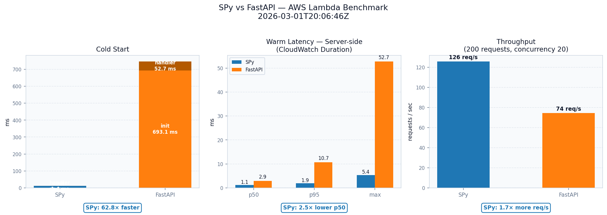

# SPy running on AWS lambda

This demo show how SPy can be used to serve web requests on AWS lambda.

The most interesting files are:

  - [`hello.spy`](./spyapi-demo/hello.spy): an hello world, showing how to use the
    `SPyAPI` library.

  - [`demo.spy`](./spyapi-demo/demo.spy): a slightly more complex demo, using f-strings to render
    HTML templates.

  - [`spyapi.spy`](./spyapi-demo/spyapi.spy): source code for the `SPyAPI` library. It
    has an interface which is inspired by `FastAPI`, but it's just a toy and not even
    close to be complete and/or compatible and/or production ready. However, it's
    complex enough to showcase some of the reasons which make SPy unique.

  - [`fastapi-demo/main.py`](./fastapi-demo/main.py): the same demo, but using CPython +
    FastAPI. The overall structure of the file is remarkably similar to the SPy one.

## Compiling and running the SPy version

**WARNING**: this demo requires the branch
[`experimental/spyapi-aws-lambda`](https://github.com/spylang/spy/tree/experimental/spyapi-aws-lambda)
of the SPy repository. Last tested commit: `9f67d2b2` on 2026-03-02.

It is important to underline that is is **demoware**, and it's not even alpha quality.

The `spyapi-aws-lambda` branch contains a vibe-coded, unreviewed, untested and probably
buggy implementation of the following features which are used by `spyapi.spy`:

  - f-strings

  - the `aws` module to interact with AWS lambda APIs

  - `__spy__.UNROLL_RANGE`, to unroll a for loop at blue-time

  - a couple of other smaller hacks needed to make it compilable.

That said, once you have installed `spy`, you can compile the demo this way:

```
❯ cd aws-lambda/spyapi-demo/

❯ spy build --static --release demo.spy
[release] build/demo

❯ ls -lh build/demo
-rwxrwxr-x 1 antocuni antocuni 3,0M mar  2 18:10 build/demo*

❯ ./build/demo
aws: AWS_LAMBDA_RUNTIME_API not set
```

`./build/demo` is a statically linked executable which can be run using [Lambda's
OS-only runtime](https://docs.aws.amazon.com/lambda/latest/dg/runtimes-provided.html),
the same used by e.g. go and rust.

For local development, you can use `aws_devserver.py` (vibe-coded):

```
❯ python aws_devserver.py ./build/demo
Lambda Runtime API on 127.0.0.1:9001
HTTP frontend on 0.0.0.0:8080
Open http://localhost:8080/
Starting: ./build/demo
```

## Deploy to AWS

See [DEPLOY.md](./DEPLOY.md).

## Benchmarks

The following chart compares the performance of the SPy and the FastAPI versions. The
most impressive improvement is the cold start latency, where SPy is ~60-80x lower than
CPython+FastAPI: this is due to a combination of reasons:

  - being a statically linked, the executable can start immediately without having to
    initialize the CPython interpreter;

  - on CPython, all the `import`s happen at startup. In SPy, all the `import`s are
    resolved and executed at compile time;

  - on CPython, the `@app.get()` decorators and more in general the FastAPI-specific
    initialization logic run at runtime. On SPy, all the logic is `blue` and
    pre-evaluated at compile time.


